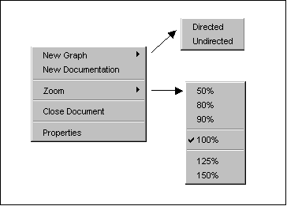

# VisualGraph Documentation

## Starting VisualGraph

The VisualGraph application can be started by running the java application class `Dsf_Main`, e.g. java -jar ./VisualGraph.jar.

---

## Projects

Projects can contain various documents. To create new documents such as graphs or documentation, the user must first create a project. This can be done either via the button **New Project** or via the context menu of the project bar.

The *Project Bar* is located at the top of the initial window and contains the following buttons and areas:

The context menu of the project bar can be accessed by right-clicking within the context menu area.

The context menu contains, in addition to the functions of the project bar, the possibility to save a project under a different name ("Save As..." function) and to close the current project ("Close-Project" function).

When a new project is created (via the "New Project" button or via the "New Project" function of the context menu), it appears in the "List of open projects". With several simultaneously open projects, you can switch to a project by clicking on the respective project button in the list of open projects. If the display area of the list of open projects is too small for all project buttons, you can browse the list via the navigation buttons on the right edge of the project bar.

Existing projects can be loaded via the "Open Project" button or via the "Load Project" function of the context menu. A file selection dialog appears, through which the corresponding project file (file with suffix `.vgp`) can be selected.

Storing or saving projects happens either via the "Save Project" button or via the "Save Project" function of the context menu. Unnamed projects must first be assigned a filename. The `.vgp` file suffix is automatically appended when saving. Once a project is saved, the filename also serves as the project name. Saving under a different name is then only possible via the "Save As..." function from the context menu.

Projects are closed via the "Close Project" function of the context menu. If the project was previously modified, you will be prompted to save it first to avoid losing the changes.

---

## Documents

Documents can be created or manipulated after creating a new project or opening an existing project. The necessary functions can be accessed via the *Document Bar*.

The context menu for documents can be accessed either via the "Document Context Menu" button or again by right-clicking within the context menu area.

The context menu of the document bar contains the following functions:

Via the "New Graph" function of the context menu, a new graph document can be inserted into the current project. You have the choice between a directed graph ("Directed" function) or an undirected graph ("Undirected" function).

For documenting such graph documents or for additional description of the project, a documentation page can be inserted via the "New Documentation" function.

New documents are each displayed via document buttons in the document list. By left-clicking on the respective buttons, you can switch to the view of the respective document. Here too, the navigation buttons located on the right edge of the document bar serve to browse to documents that may not be visible. If you want to display the contents of several documents side by side, you can expand the view to include this document by clicking on a document button while simultaneously pressing the shift key. The "Single Document View" button cancels the display of multiple documents and switches to the first document in the document list.

The contents of each document can be enlarged or reduced via a zoom function. For this purpose, there is a "Zoom" function in the document context menu, which allows a magnification or reduction range from 50% to 150% of the original size of the document content.

Graph documents and documentation pages have certain properties that can be displayed and changed via the "Properties" function of the context menu. The most important property that should be changed here is the name of the document.

Created documents can of course also be removed. The "Close Document" function of the context menu serves this purpose. However, this function should be used thoughtfully, as the contents of unsaved documents may be lost.

### Graph Documents

Creating graphs is done by inserting graph documents. Graph documents can contain either digraphs or undirected graphs. The choice of content of a graph document is controlled when inserting via the document bar (see above). When editing the graph, however, this distinction no longer plays a role. The most important tool when editing graph documents is the context menu, which can be opened within the document by right-clicking.

The following figure shows the functions of the context menu for graph documents:

Via the "New Node" function, a new node can be inserted into the graph. This is alternatively also possible by double-clicking with the left mouse button within the graph document.

Edges between nodes are inserted by pressing the left mouse button on the start node and holding and dragging to the end node. Edges cannot be inserted via a function of the context menu for graph documents.

Labels or legends can only be created via the "New Label" function from the context menu.

Moving nodes and labels is possible by pressing the left mouse button while simultaneously holding the shift key. The existing edges between nodes are automatically adjusted. Moving outside the visible document area is also possible, the view is updated accordingly.

The "Node Identification" function allows switching the display of node numbers between alphabetical ("alphabetical") and numerical ("numerical"). The default setting is alphabetical numbering of nodes.

For graphs whose edges are not weighted, the display of edge weights can be hidden via the "Weights" function. By default, the weights of the graph are displayed.

An additional function that can often be useful for very large graphs is the "Pack Graph" function. After calling this function, the entire graph is compressed by one third of its extent. This creates space for new nodes, edges, or labels.

Via the "Graph-Type" function of the context menu for graph documents, you can switch between three different figures for the nodes and edges of the graph.

The default setting is display as "Standard Graph", using the usual figures for nodes and edges. The "Event Graph" function switches the display of nodes and edges to figures that correspond to an event graph. The "Action Graph" function switches to figures that correspond to the representation of an activity graph.

The contents of the respective figures can be changed by double-clicking with the left mouse button. This enters an edit mode that is exited by pressing the Escape or Tab key. This allows node numbers, node weights, node descriptions, edge descriptions, and edge weights to be changed quickly and easily. To change edge weights, they must of course be displayed ("Weights" function of the context menu for graph documents).

The remaining functions of the context menu for graph documents are related to the application of algorithms and are therefore described in the corresponding section below.

Each figure also has its own context menu that makes other properties of the figures changeable. This context menu is again opened by right-clicking. Deleting nodes, edges, and labels is only possible via this context menu, which contains a corresponding function for each ("Delete Node" for nodes, "Delete Edge" for edges, and "Delete Label" for labels).

The following figure shows these context menus together:

Via the "First Node" function from the context menu for nodes, the associated node is assigned node number one, the previous node with number one receives the previous number of the now first node. The "Set Start Node" function is related to the application of algorithms and is therefore described in the corresponding section below.

The context menu for labels also allows changing the text style and size of the text ("Style" and "Size" functions).

### Documentation Documents

Documentation documents serve to describe graphs or describe entire projects. They are created by the "New Documentation" function from the context menu of the document bar.

They have their own context menu that supports the common insert, cut, copy, and undo functions for text fields.

For enlarging or reducing text, only the possibility of applying the "Zoom" function from the context menu of the document bar is available.

---

## Algorithms

To apply the graph algorithms integrated within the framework, a graph must first be assigned to an algorithm. This is done via the "Used Algorithm" function from the context menu for graph documents. The following figure shows the specific functions of this context menu:

After selecting an algorithm, its name is displayed in the upper left area of the graph document.

The "Delay" function of this menu allows setting the execution speed of the selected algorithm before applying it. An algorithm is delayed at correspondingly critical operations during non-step-by-step execution. The duration of the delay can be set via the "Delay" function in a range from 100ms to 5s. An individual setting can be made via the properties ("Properties" function) of a graph document; if this is done, it is represented by the activated "Other" function. The "Disabled" function deactivates any delay while the algorithm is executed.

If the critical operations and critical objects should be logged during algorithm execution, this can be set via the "Write Protocol" function. When the function is activated, a separate protocol document is then output.

Via a "Variable Monitor" document, the critical objects, i.e., the data structures that an algorithm uses and modifies during its processing, can be visualized. If a "Variable Monitor" document should be displayed during algorithm execution, the "Monitor Variables" function in the context menu must be activated.

For algorithms that require a start node for their execution (e.g., the Dijkstra algorithm), a start node may still need to be defined. This can be done via the context menu of the corresponding node via the "Set Start Node" function. The first node of the graph is always preset as the start node.

Two different control options are available for executing an algorithm. On one hand, the algorithm can be executed without stopping at defined breakpoints ("Play" function), on the other hand, step-by-step execution is possible ("Step" function), which stops at the breakpoints explicitly defined in the algorithm. This is controlled via buttons located in the left half of the document bar.

An algorithm that was started via "Play" or "Step" can be stopped at any time via the "Stop" button. After stopping, the processing can be continued by "Play" or "Step".

Via the "Info" button, after assigning an algorithm to a graph, a document can be displayed that contains hints and information about the algorithm. This information document can also be displayed at any time during algorithm execution.
