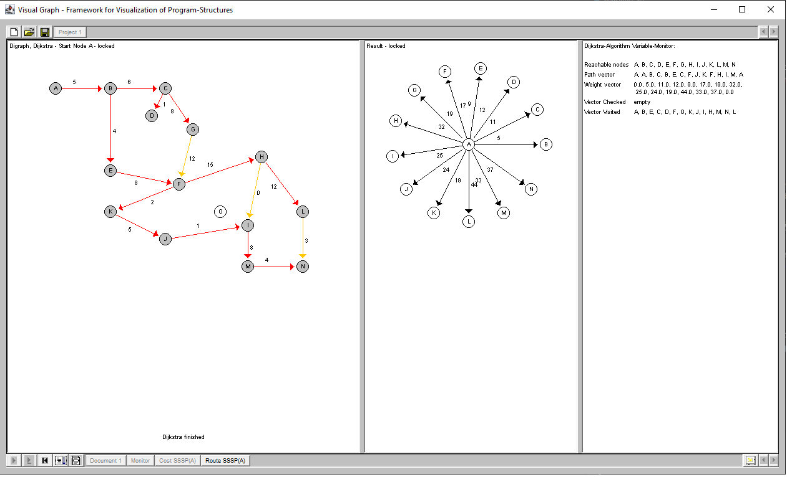

# VisualGraph

VisualGraph is a java based application to visualize the single steps of a graph or sequence based algorithm. The visualization is very useful to get a better understanding how the respective algorithm works. 

The following graph and sequence based algorithms are contained:  

*	TopSort	(Sequence sort)
*	Bubble Sort (Sequence sort)
*	Quick Sort (Sequence sort)
*	Merge Sort (Sequence sort)
* 	Warshall (Graph: find shortest path between nodes)
* 	Dijkstra (Graph: find shortest path)
* 	Kruskal (Graph: find minimum spanning tree)
* 	Ford-Fulkerson (Graph: find maximum flow)

Example Dijkstra algorithm applied on a directed graph (result: shortes paths from start node to any other): 

One characteristic of VisualGraph is, that it can easily be extended with additional algorithm representations. 

To start the application, enter: java -jar ./VisualGraph.jar
Application help can be found under folder [help](Help/help.md).

Remark: The application was initially developed 1998 as one part of my master thesis using java sdk 1.2. The current code was adapted to the java LTS version 21.0.1.

